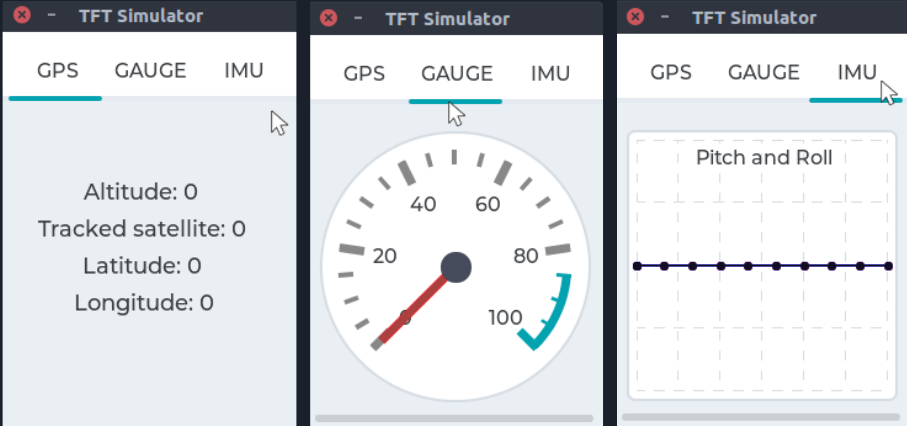

# LVGL Demo embarcadores
Aplicação de exemplo usando a biblioteca gráfica [LVGL](https://github.com/lvgl/lvgl). 

# Introdução
O presente projeto foi desenvolvido com o intuito de demonstrar a utlização da biblioteca gráfica open source [LVGL](https://github.com/lvgl/lvgl). Essa biblioteca é escrita em linguagem `C`, voltada principalmente para criação de `GUI's` (*Graphical User Interface*) para microcontroladores e sistemas com poucos recursos.

A plataforma *target* microcontrolada utilizada foi o kit de desenvolvimento `STM32F429-Discovery`, pois o mesmo possui interface com display *TFT*, facilitando a prototipação e desenvolvimento.

O código é portável entre plataformas `x86` (simulador) e `arm` (STM32), mediante configuração de build.

# Entendendo a aplicação
A aplicação interfaceia alguns dispositivos de hardware e utiliza seus dados como fonte de atualização de componentes gráficos na tela.
A tela da nossa aplicação é criada apartir de uma `tabview`, um componente gráfico (*widget*) que permite a inserção de múltiplas `tabs` (abas).
Cada `tab` corresponde a um dispositivos de hardware em específico:
- GPS tab: mostra os dados de um módulo GPS
- Gauge tab: mostra o valor de um potenciômetro
- IMU tab: mostra os valores de um módulo de IMU



Embora o display utilizado possua um controlador de *touchscreen*, a escolha final foi utilizar um hardware externo como dispositivo de entrada, no caso um `encoder rotativo`.

# Dependências

## Software
Para realizar a compilação e execução do projeto será necessário:
- Um computador `host` rodando algum sistema operacional `GNU/Linux`
- Compilador [arm-none-gnueabi-gcc](https://developer.arm.com/tools-and-software/open-source-software/developer-tools/gnu-toolchain/gnu-rm/downloads) para microcontroladores `arm cortex M`
- Ferramentea `make` para utilização de arquivos `Makefile`
- Biblioteca [LVGL](https://github.com/lvgl/lvgl) (versão superior a `7.0`)
- Ferramenta [openOCD](http://openocd.org/) para gravação e depuração do firmware

Caso o usuário queira realizar algum tipo de modificação de periféricos, pode se utilizar a ferramenta de geração de código [STM32CubeMX](https://www.st.com/en/development-tools/stm32cubemx.html). 

## Hardware
Para executar o projeto será necessário:
- Placa [STM32F429-Discovery](https://www.st.com/en/evaluation-tools/32f429idiscovery.html)
- Encoder rotativo `KY-040`, 
- Módulo `GPS NEO6MV2`, 
- Módulo `IMU` (*Inertial Measurement Uniit*) `MPU-6050`
- Potenciômetro 10K.

## Simulador
Caso o usuário não disponha do hardware necessário, pode se utilizar o [simulador](https://github.com/lvgl/lv_sim_eclipse_sdl) para rodar apenas a aplicação gráfica de alto nível diretamente no computador host. 

# Baixando o projeto e a biblioteca LVGL

```bash
# Clonando o repositório
$ git clone https://github.com/JON95Git/lvgl-demo-embarcadores

# Navegando até o diretório onde será clonado o repositório do LVGL
$ cd lvgl-demo-embarcadores/app/gui

# Clonando o repositório do LVGL
$ git clone https://github.com/lvgl/lvgl

```

Observação: Caso queira clonar o repositório do LVGL em outro diretório, será necessário alterar o arquivo `compile.conf`

# Baixando o simulador
O repositório do [simulador](https://github.com/lvgl/lv_sim_eclipse_sdl) possui um `README` detalhandos os passos para sua instalação, portanto esses passos não serão descritos aqui.

# Configurando o projeto
Assim que um novo repositório do LVGL é baixado, é necessário realizar algumas configurações:
- Habilitar o arquivo `lv_conf.h`:
```bash
# Navegando até o repositório do LVGL
$ cd lvgl

# Renomeando o arquivo de template para ser usado como arquivo de configuração
$ mv lv_conf_template.h lv_conf.h

# Editando o arquivo de configuração
$ nano lv_conf.h

# Navegue até a linha 10 do arquivo lv_conf.h e mude 
# de
if 0
# para
if 1
```
- Ajustar resolução do display:

```bash
# Navegue até a linha 23 do arquivo lv_conf.h e altere as configurações de resolução
define LV_HOR_RES_MAX    (240)
define LV_VER_RES_MAX    (320)

```

- Utilizando a versão correta do `LVGL`, para isso é necessário que seja uma versão superior a `7.0`:

```bash
# Navegando até o diretório onde será clonado o repositório do LVGL
$ cd lvgl-demo-embarcadores/app/gui/lvgl

# Verificando a versão do LVGL
$ git branch

# Caso a versão do LVGL seja inferior a 7.0
$ git checkout release/v7

```

## Simulador
A aplicação gráfica está isolada em `app/gui`.

Será necessário fazer com que os arquivos presentes em `app/gui` estejam visíveis para o `simulador`. Isso pode ser feito utilizando `links simbólicos`.

É necessário criar os diretórios onde serão inseridos os `links simbólicos` no projeto do `simulador`, para isso execute:

```bash
# Navega até o diretório onde foi clonado o repositório do simulador
$ cd pc_simulator_sdl_eclipse

# Criando diretórios para suportar links simbólicos aos arquivos da GUI
$ mkdir gui

# Navega até o diretório da GUI
$ cd gui

# Criando diretórios para suportar links simbólicos aos arquivos de components da GUI
$ mkdir components
```

Para criar `links simbólicos` da aplicação gráfica para o `simulador`, execute:

```bash
# Cria link simbólico dos arquivos .c
$ ln -s ../../lvgl-demo-embarcadores/app/gui/*.c .

# Cria link simbólico dos arquivos .h
$ ln -s ../../lvgl-demo-embarcadores/app/gui/*.h .

$ cd components

# Cria link simbólico dos arquivos .c
$ ln -s ../../../lvgl-demo-embarcadores/app/gui/components/*.c .

# Cria link simbólico dos arquivos .h
$ ln -s ../../../lvgl-demo-embarcadores/app/gui/components/*.h .
```
Ao final, haverá uma hierarquia de diretórios da seguinte forma:

```
simulador/  
│
└───gui/
    │   gui_app.c
    │   gui_app.h
    │   gui_hardware_interface.c
    |   gui_hardware_interface.h
    |   gui_widgests.c
    |   gui_widgests.h
    └───components/
        │   gui_chart.c
        │   gui_chart.h
        │   gui_gauge.c
        |   gui_gauge.h
        |   gui_gps.c
        |   gui_gps.h
```

Dessa forma, toda alteração realizada em qualquer um dos projetos (`firmware` ou `simulador`) será vista por ambas as partes.

# Compilando o projeto
Como o projeto utiliza a ferramenta `make` para automatização do processo de compilação, é necessário apenas as chamadas:

```bash
# Compilando o projeto
$ make

# Limpando a build do projeto
$ make clean
```

# Gravando o firmware na placa
Para gravar o firmware é necessário possuir o `openOCD` instalado na máquina.
Executa o seguinte comando:

```bash
$ openocd -f /usr/local/share/openocd/scripts/board/stm32f429discovery.cfg  -c 'program build/lvgl-demo-embarcadores.bin  0x08000000 verify reset exit'

```

# Opcionais

O projeto dispõe de um diretório oculto chamado `.vscode`, onde estão as configurações criadas para `build`, `debug` e `flash` do projeto apartir do ambiente do [VS Code](https://code.visualstudio.com/). 
Para um correto funcionamento nesse ambiente, é necessário instalar as seguintes extensões:
- [C/C++ Intellisense](https://github.com/microsoft/vscode-cpptools)
- [Code Runner](https://github.com/formulahendry/vscode-code-runner)
- [Cortex Debug](https://github.com/Marus/cortex-debug)